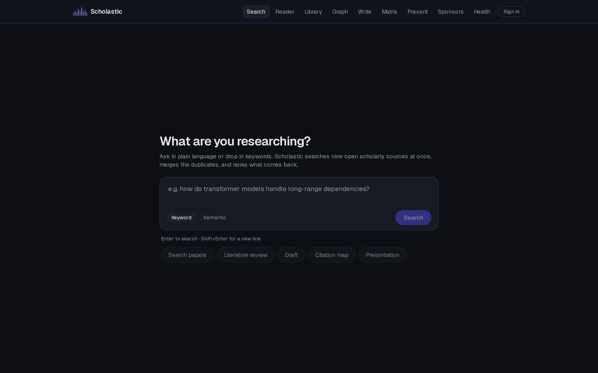
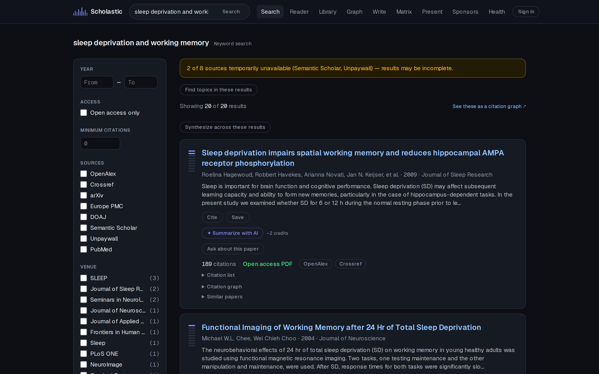
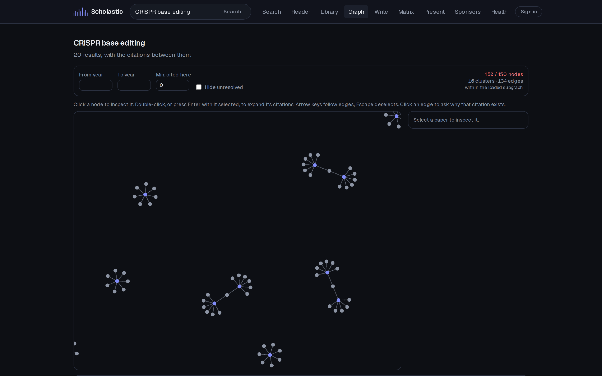
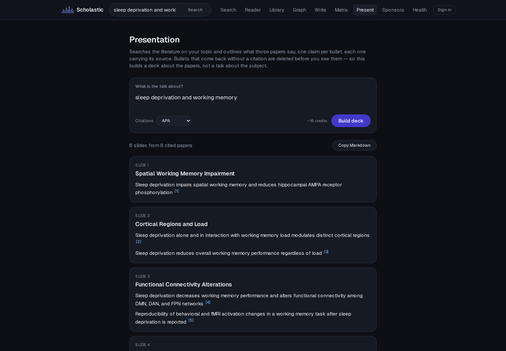
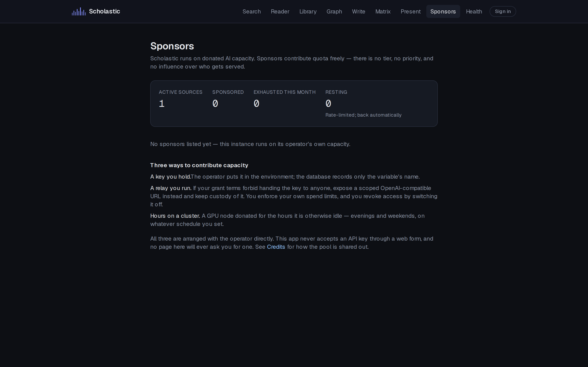

# Scholastic

**A research workspace that refuses to make things up.**

Search nine open scholarly sources at once, read papers with a copilot that cites the page it
answered from, compare them in a matrix where every cell carries its evidence, and draft
manuscripts and slide decks that cannot contain an uncited claim.

Self-hostable, MIT-licensed, and useful with no API keys at all — every AI feature is optional
and says so when it is switched off, rather than breaking.



---

## Why this exists

Most research tools generate confident prose and leave you to check it. Scholastic inverts
that: **attribution is enforced mechanically, and unattributable output is deleted before you
see it.**

- **A drafted sentence with no citation is removed**, not flagged. Same for a slide bullet. If
  nothing survives, you get an empty draft that explains why — never invented findings.
- **A matrix cell that a paper does not report stays blank**, and that is a database constraint
  rather than a convention. "Did not report it" and "we failed to find it" collapsing into the
  same blank is how a comparison table starts lying.
- **Every extracted value keeps its page and its sentence.** Click a number, land on the line
  it came from.
- **Structural graph claims are labelled "within the loaded subgraph"**, because a centrality
  score over a partial citation network is not a fact about the literature.

## What it does

### Search across nine sources, merged

OpenAlex · Crossref · PubMed · arXiv · Semantic Scholar · Europe PMC · CORE · DOAJ · Unpaywall,
queried in parallel, deduplicated by DOI with a fuzzy fallback, then ranked. Dedup favours
precision: a preprint and its published version may show twice, which is a better failure than
silently merging two different papers. When a source is down, results still come back and the
page says which source is missing.



### Read, extract, compare

A split PDF reader whose chat answers with `[p. N]` citations you can click. Table and statistic
extraction from uploaded papers. An evidence matrix — papers down the side, fields across the
top — where "Fill empty cells" runs extraction across every paper at once and each filled cell
keeps its provenance. Exports to CSV for a spreadsheet or Markdown for a draft, quotes included.

### Map the citations

A full-page graph explorer over a tested pure graph layer. Expand a node's citations, ask why
one paper cites another, filter by year or citation count.



### Write with citations that are objects, not text

A manuscript editor where citations are structured references: the bibliography derives itself,
switching style rewrites nothing, and exports go to Markdown, LaTeX, BibTeX and RIS. Plus a deck
outliner that turns a topic into Marp slides — one claim per bullet, each carrying its source.



### A capacity commons, not a paywall

AI features run on donated capacity. Credits allocate a shared pool; they are **never
purchasable, never transferable, and never earned by using the app** — which is why running out
returns a 403 rather than a 402. Nothing here is for sale.

Sponsors can donate three ways, differing in custody rather than technology: a key the operator
holds in the environment, a **relay they run and never hand over** (for labs whose grant terms
forbid exporting a credential), or **cluster hours on a schedule**. The database never stores a
provider key — only the _name_ of an environment variable. There is no web form that accepts a
pasted API key, and there will not be one.



## Quick start

Requires Node 20+, pnpm, and PostgreSQL with the `pgvector` extension.

```bash
pnpm install
cp .env.example .env.local   # set at least DATABASE_URL — see SETUP.md
pnpm db:migrate
pnpm dev
```

Open http://localhost:3000 and search for something. No API key is needed to search — the nine
scholarly sources are open. Add an LLM key later to switch on summaries, chat, extraction and
drafting; without one, those features are absent and say so.

```bash
pnpm test       # 764 unit + integration tests (Vitest)
pnpm test:e2e   # 29 browser tests (Playwright) — none of them spends a credit
pnpm lint
pnpm build
```

## Built with

Next.js 16 (App Router, Turbopack) · React 19 · TypeScript · Tailwind v4 · PostgreSQL + pgvector
· Drizzle ORM · better-auth · Tiptap · pdf.js · Vitest · Playwright

Six LLM backends are supported behind one interface (Anthropic, Groq, SambaNova, Mistral,
OpenRouter, Google), plus any OpenAI-compatible endpoint — including a local Ollama or vLLM
server, which keeps everything on your own hardware.

## Documentation

| Document                                         | What's in it                                                    |
| ------------------------------------------------ | --------------------------------------------------------------- |
| [`SETUP.md`](./SETUP.md)                         | Prerequisites, environment variables, running locally           |
| [`ARCHITECTURE.md`](./ARCHITECTURE.md)           | System design, provider contract, resilience, dedup and ranking |
| [`ROADMAP.md`](./ROADMAP.md)                     | What's built, what's next, what is deliberately out of scope    |
| [`KNOWN_LIMITATIONS.md`](./KNOWN_LIMITATIONS.md) | Trade-offs and gaps, written down as decisions                  |
| [`CHANGELOG.md`](./CHANGELOG.md)                 | Release history                                                 |
| [`docs/specs/`](./docs/specs/)                   | Design documents, one per sub-project                           |

`KNOWN_LIMITATIONS.md` is worth reading before filing a bug — several surprising behaviours are
deliberate and explained there.

## License

[MIT](./LICENSE) © 2026 Gautam Karat
